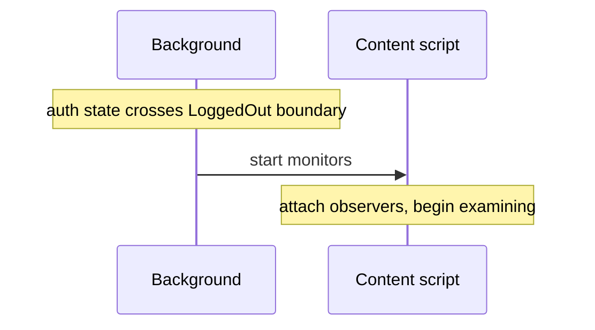
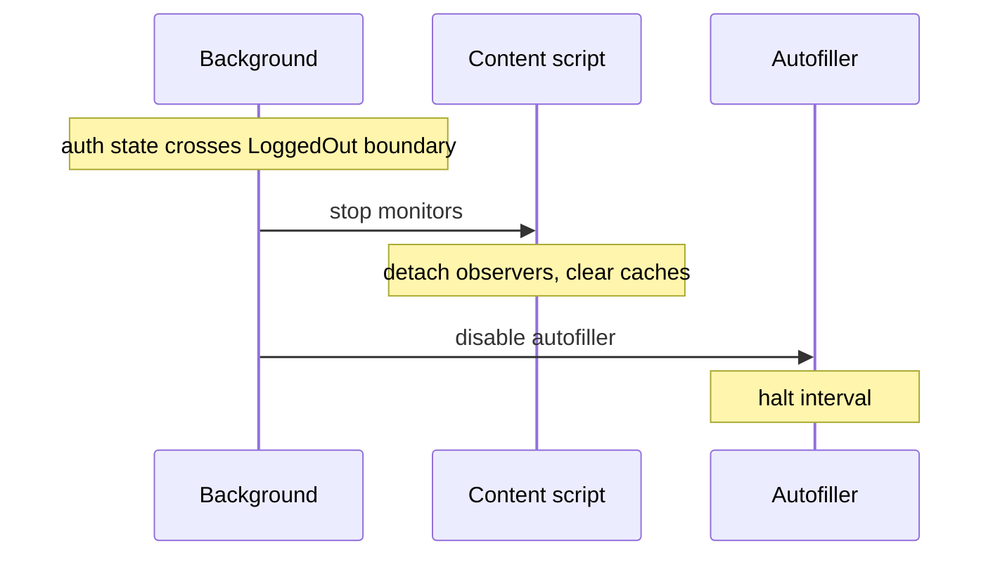
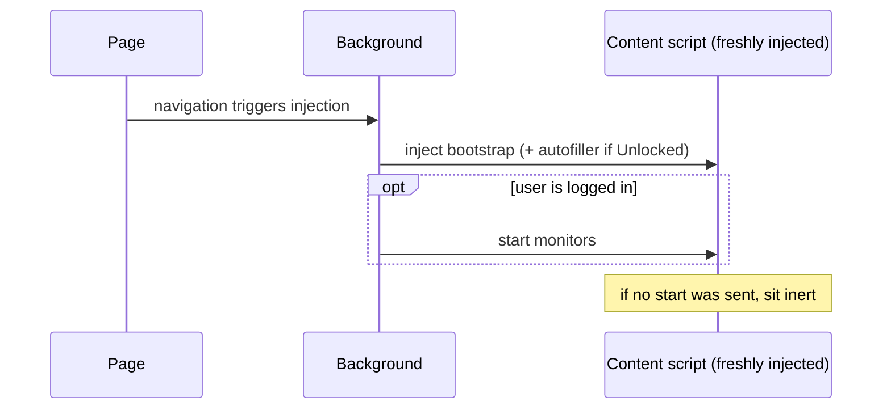

# Autofill monitoring lifecycle

## The problem

Bitwarden's autofill content scripts are injected into every page a user visits. They examine form fields, observe DOM mutations, position the inline menu, and surface notifications. That examination is valuable when the user has reason to want it, and inert work otherwise.

Autofill runs inside an environment shaped by three lifecycles it observes but does not own:

- **The page lifecycle** — a page loads, then navigates. Within a single-page app a navigation swaps content without reloading the document, so a content script, once injected, persists across many navigations.
- **The account lifecycle** — an account logs in, locks and unlocks, and logs out. Examination is warranted only while an account is logged in: it should begin at login and stop at logout.
- **The extension lifecycle** — the extension process starts and stops. Firefox runs Manifest V2 with a persistent background page; Chrome runs Manifest V3, whose background is a service worker the browser terminates and restarts at will. In-memory background state is therefore durable on Firefox but ephemeral on Chrome, where it must be reconstructed on each restart.

These three are out of autofill's control; autofill must align its own behavior with them. The obstacle is that a content script, once injected, cannot be unloaded — only extension context loss, such as a navigation or page refresh, removes it. Refreshing is not an option, as it could lose the user's in-progress work, and navigation cannot be relied upon within single-page apps. So examination cannot be governed by injecting and unloading content scripts; it must be toggled in place as the lifecycles above demand.

## Architecture

Autofill's in-scope concern is the **monitoring lifecycle** — when autofill is actively engaged with a page. This work lives entirely in content scripts and is directed at the page: `AutofillMonitor` implementations examine fields and guard overlay integrity, and a separate page-transition monitor watches for loads and navigations.

The background `AutofillLifecycleService` owns this lifecycle. It starts and stops the content-script monitors as the account lifecycle crosses the logged-in boundary, and rebuilds them across the extension lifecycle when Manifest V3 restarts. Page-transition reports flow to it, and it decides what they warrant. The monitors stay simple: they examine and report.

Knowing which frames are live is one of the service's responsibilities. Every injected frame is a content script the service can address, and that knowledge is what protocol commands are sent to and what tells the service when a buffered transition can no longer be honored — when a frame is gone, a transition still waiting on it is abandoned.

A content script's life has two scopes:

- _Monitoring_ is the active and reversible scope — it gathers indicators of fillable elements on the page and protects the integrity of autofill overlays. Its resources (observers, cached field maps, integrity-check timers) exist only while monitoring is in flight.
- _Disposal_ is the terminal scope — it removes injected DOM, nulls iframes, and tears down the rest of the graph.

These scopes are formalized by separate interfaces. The `AutofillMonitor` contract takes the reversible scope; `destroy()`, where present, takes the terminal one. Where both apply to a service, `destroy()` chains through `stopMonitoring()` first, so terminal cleanup always begins from a fully-detached state.

Monitoring may be entered and exited many times during a single content script's life, absorbing every on-demand toggle. Disposal happens exactly once, at the end, and is irreversible.

UI concerns — the autofill context menu, the overlay's event handlers, the notification surfaces — are deliberately _outside_ the monitoring scope. They are part of the always-on UI plane, not the examination system. Their interaction with monitoring is one-directional: they read monitoring's caches when monitoring is in flight, and find empty state when it is not. Empty state is a valid outcome at every UI consumer; the absence of monitoring data is itself the gate that keeps the UI inert.

## The `AutofillMonitor` contract

```ts
interface AutofillMonitor {
  startMonitoring(): void;
  stopMonitoring(): void;
}
```

The contract describes what implementors must guarantee so that the controller above them can reason about lifecycle correctness without knowing the details of any particular monitor.

### Construction is inert

Constructors do no I/O and attach no listeners to globals. A freshly-constructed monitor produces no observable effects on the page; real work begins only when `startMonitoring()` is called.

Because construction has no side effects, the bootstrap constructs every monitor unconditionally, regardless of the auth state at injection time. A bootstrap injected into a logged-out tab sits in the page without examining anything until a signal arrives to begin.

### Monitoring is reversible and may repeat

`startMonitoring()` and `stopMonitoring()` may each be called many times across a content script's life. `startMonitoring()` begins examination against the page as it is at the moment of the call; `stopMonitoring()` detaches what was attached and discards what was cached.

Both methods are idempotent. A call to either is safe whether the monitor is currently running or not. Idempotency lets the controller call `stopMonitoring()` from any cleanup path — including disposal — without first checking state, and lets the protocol treat lifecycle commands as plain toggles rather than state-aware transitions.

### Monitoring-scoped state is cleared on stop

Any data a monitor caches in service of its examination — field maps, integrity-check state, fill-history bookkeeping — is monitoring-scoped. `stopMonitoring()` clears that state along with detaching observers. A future `startMonitoring()` begins with a clean view of the current page rather than reasoning against stale data left over from a prior session.

Clearing on stop is also what keeps the always-on UI safe while monitoring is paused. UI handlers that consult monitoring data find empty state and gracefully no-op. There is no in-flight "monitoring is paused" flag the UI has to consult; the cache being empty is the signal.

### The controller is the sole lifecycle caller

Monitors compose under a controller (the content-script services compose under `AutofillInit`). The controller is the only thing that calls `startMonitoring()` or `stopMonitoring()` on its sub-monitors. Sub-monitors do not call each other; external collaborators do not reach into them.

One owner of lifecycle calls means lifecycle reasoning is local to the controller. The controller decides which transitions are reachable and from where; sub-monitors do not need to coordinate.

### `destroy()` ≡ `stopMonitoring()` + disposal

Services that own both reversible and terminal work expose both methods. The identity holds: `destroy()` calls `stopMonitoring()` first, then performs disposal — UI removal, iframe nulling, terminal tombstones that mark the service unusable.

This composition keeps each scope focused. Anything reversible belongs to monitoring; anything that requires graph-wide teardown belongs to disposal. The two never entangle.

## The page lifecycle

A page-lifecycle monitor watches for the moments a page becomes ready to act on — its load, and the navigations that follow — and reports each as a transition. It does not examine field data and is **not** an `AutofillMonitor`. The autofiller (`apps/browser/src/autofill/content/autofiller.ts`) is the current monitor of this lifecycle: it polls for URL changes and, on each transition, reports a `pageTransitionDetected` fact to the background.

Reporting is one-directional. The monitor states that a transition happened; it does not consult monitoring state, settings, or auth status, and it does not decide whether a fill should follow. Those are the background's decisions, made at a single evaluation point (see [Buffering transitions](#buffering-transitions)). This keeps the page-lifecycle monitor simple and lets new transition producers feed the same point without each re-deriving policy.

The autofiller's content-script lifecycle is asymmetric in three respects:

- **Injection-gated start.** `autofiller.js` is added to the injection list only when `triggeringOnPageLoad && autoFillOnPageLoadIsEnabled`, and `autoFillOnPageLoadIsEnabled` can only be true when the user is unlocked. Locked or logged-out users get no fresh autofiller on a navigation; injection itself is the authorization gate.
- **Survives lock.** A running autofiller continues to poll for URL changes through `Unlocked → Locked`. The background ignores its transition reports while the vault is locked; on `Locked → Unlocked` it resumes reporting with no message exchange. Only logout disables a running monitor.
- **Message-driven disable on logout.** On the transition into `LoggedOut`, any running autofiller halts on receipt of `AutofillerCommand.disable`. The handler reuses the existing `handleExtensionDisconnect` cleanup — clearing the interval and any pending delay timeout — so disable and context-loss teardown share a single code path.
- **Terminal teardown on context loss.** Already responds to `setupExtensionDisconnectAction`.

There is no `enableAutofiller` message. Re-enabling happens by re-injection on the next page-load when the user is unlocked. The autofiller's content-script lifecycle, in full: _inject (when unlocked) → report transitions → (disable on logout | dispose on context loss)_.

### Buffering transitions

Autofill can only fill a frame that is monitoring — monitoring is what makes the page details available to act on. Autofill-on-load therefore depends on monitoring, and the two are not ordered against each other: injection adds the autofiller, which begins reporting at page load, while the `start monitors` command follows separately. A transition can be reported before monitoring has started on a freshly-injected frame.

The background bridges that sequencing gap by buffering. A reported transition is held until its frame is monitoring, then resolved into a page-details collection; one reported after monitoring is already running resolves immediately; one whose frame is retired before monitoring starts — the frame disconnects, or the account logs out — is dropped rather than acted upon, so a pending transition never outlives the conditions that warranted it. The buffer keys on `(tab, frame)`, so simultaneous navigations across many frames each resolve independently.

A resolved transition collects the frame's page details, and those details drive an autofill of the active tab.

## The lifecycle protocol

Lifecycle messages flow one-way from the background to content scripts. Three commands compose the protocol:

- **start monitors** — content scripts begin or resume examination
- **stop monitors** — content scripts pause examination
- **disable autofiller** — running autofillers halt their page-lifecycle reporting

The first two are paired and symmetric; the third is asymmetric. All three commands are idempotent at their receivers, so the broadcast layer can fan out without worrying about exact receiver state.

### Routing

Knowing which frames are live (above) is what makes routing possible: each injected bootstrap and autofiller is a content script the service can address, from injection until extension context loss. A lifecycle command fans out to every live `(tab, frame)`.

Frame liveness is in-memory background state, so it does not survive a Manifest V3 restart. On restart the background re-injects into every open tab, re-establishing both the connections it tracks and monitoring itself. That rebuild is on the critical path for autofill-on-page-load: because a fill depends on monitoring, a transition reported after a restart cannot be honored until monitoring has been re-established for its frame.

### Triggers

Two events emit lifecycle commands. One auth-state boundary drives all of the broadcast traffic:

| Trigger           | Target               | Commands sent                                                                  |
| ----------------- | -------------------- | ------------------------------------------------------------------------------ |
| Per-tab injection | One `(tab, frame)`   | `start monitors` if the user is logged in (Locked or Unlocked); otherwise none |
| Login             | Every `(tab, frame)` | `start monitors`                                                               |
| Logout            | Every `(tab, frame)` | `stop monitors` _and_ `disable autofiller`                                     |

The `Unlocked` boundary participates separately, but only at injection time: it gates whether a fresh navigation gets an autofiller. Transitions across `Unlocked` (lock and unlock events) do not emit any broadcast.

### Message sequences

#### Logging in (`LoggedOut → Locked` or `LoggedOut → Unlocked`)



Sent to every live `(tab, frame)`.

#### Logging out (any logged-in state → `LoggedOut`)



`disable autofiller` is sent to every live tab. Tabs that never had an autofiller (because the user was Locked at the time of their navigation) receive the message and no-op.

#### Locking the vault (`Unlocked → Locked`)

No broadcast. Monitors continue. A running autofiller continues its URL-change poll; the background ignores its transition reports until the vault is unlocked again. New navigations during the locked window get no autofiller (injection gate).

#### Unlocking the vault (`Locked → Unlocked`)

No broadcast. Monitors are already running. An autofiller surviving from a prior Unlocked window resumes reporting transitions with no message exchange. Tabs that navigated during the locked window pick up an autofiller on their next navigation, via the injection gate.

#### New tab or frame on navigation



A page-level trigger script at `document_start, all_frames, *://*/*` wakes the service worker on every navigation regardless of auth state, so this flow runs on every new tab and frame — including for logged-out users, whose tabs end up with an inert bootstrap and no autofiller.

## Disposal

The graph-wide disposal path fires exactly once, on extension context loss. It runs `stopMonitoring()` first so disposal always begins from a known, fully-detached state. Then it removes the always-on listeners (the background-message listener and the context-menu listener), clears terminal scratchpads, and calls `destroy()` on each sub-service for the graph-wide cleanup of UI, iframes, and any other resources that have no place in monitoring's reversible scope.
